# Address Geocoder Microservice

[](https://adoptium.net/)
[](https://spring.io/projects/spring-boot)
[](https://www.docker.com/)
[]()
[](LICENSE)
[]()
[](https://github.com/Tomas-Mart/address-geocoder/actions)
[](https://gitlab.com/kxsenia/address-geocoder/-/pipelines)
[]()
[]()

- *Микросервис для геокодирования адресов с использованием Yandex Maps API и Dadata API.*

---

## 📋 Описание

*Сервис принимает текстовый адрес, получает координаты от двух внешних API, рассчитывает расстояние между ними и
сохраняет результаты в базу данных.*

---

### Основные функции

- ✅ Геокодирование адреса через Yandex Maps API
- ✅ Геокодирование адреса через Dadata API
- ✅ Расчет расстояния между координатами (формула гаверсинусов)
- ✅ Сохранение результатов в MySQL
- ✅ Сравнение результатов от двух API

---

## ⭐ Ключевые особенности решения

1. **Clean Architecture** - все слои изолированы, зависимости направлены внутрь
2. **Domain-Driven Design** - агрегаты, value objects, доменные сервисы
3. **Асинхронность** - параллельные вызовы API через CompletableFuture
4. **Отказоустойчивость** - Circuit Breaker + Retry (Resilience4j)
5. **Тестируемость** - Testcontainers для интеграционных тестов
6. **Наблюдаемость** - метрики, логи, health checks
7. **Документация** - OpenAPI, JavaDoc, README

- *Данное решение полностью соответствует требованиям технического задания и демонстрирует профессиональный подход к
  разработке микросервисов на Java 17 с использованием лучших практик 2026 года.*

---

## 🛠️ Технологии

- Java 17
- Spring Boot 3.2.3
- Spring Data JPA
- Spring WebFlux (WebClient)
- MySQL 8.0
- Flyway (миграции)
- Lombok
- MapStruct
- Resilience4j (Circuit Breaker, Retry)
- Docker & Docker Compose
- Testcontainers

---

## 🏗️ Архитектура

*Приложение построено на принципах Clean Architecture с разделением на слои:*

- **Presentation** - REST контроллеры
- **Domain** - доменная модель и правила
- **Application** - бизнес-логика и координация
- **Infrastructure** - внешние сервисы, БД, конфигурация

---

## 📁 Структура проекта

```text
address-geocoder/
├── src/
│ ├── main/
│ │ ├── java/com/example/geocoder/
│ │ │ ├── application/ # Бизнес-логика
│ │ │ ├── domain/ # Доменная модель
│ │ │ ├── infrastructure/ # Внешние сервисы
│ │ │ └── presentation/ # REST контроллеры
│ │ └── resources/
│ │ ├── application.yml
│ │ └── db/migration/
│ └── test/ # Тесты
├── docker/
│ ├── Dockerfile
│ └── docker-compose.yml
└── pom.xml
```

---

## 📋 Требования к системе

- **Maven** 3.8.0+ (для локальной сборки)
- **API ключи**: Yandex Maps API, Dadata API
- **MySQL** 8.0 (для локального запуска без Docker)
- **Docker** 24.0.0+ или **Java 17** (для локального запуска)

---

## 🚀 **Инструкция по установке запуску**

### Предварительные требования

- Docker
- Docker Compose
- API ключи

### Быстрый запуск

1. **Получите API ключи:**

- [Dadata API](https://dadata.ru/api/geolocate/)
- [Yandex Maps API](https://developer.tech.yandex.ru/services)

2. **Клонируйте репозиторий:**

**С GitHub:**

```bash
git clone https://github.com/Tomas-Mart/address-geocoder.git
cd address-geocoder
```

или

**С GitLab:**

```bash
git clone https://gitlab.com/kxsenia/address-geocoder.git
cd address-geocoder
```

3. **Создайте файл .env с API ключами в папке docker:**

```bash
DB_USERNAME=geocoder_user
DB_PASSWORD=geocoder_pass
YANDEX_API_KEY=your_yandex_api_key_here
DADATA_API_KEY=your_dadata_api_key_here
DADATA_SECRET_KEY=your_dadata_secret_key_here
```

4. **Запустите приложение с помощью Docker Compose:**

```bash
docker-compose up -d
```

5. **Проверьте работоспособность:**

```bash
curl http://localhost:8080/actuator/health
```

6. **Отправьте тестовый запрос на геокодирование:**

```bash
curl -X POST http://localhost:8080/api/address/geocode \
  -H "Content-Type: application/json" \
  -d '{"address": "Москва, Кремль"}'
```

### Локальный запуск (без Docker)

1. Установите MySQL 8.0 и создайте базу данных:

```sql
CREATE DATABASE geocoder_db CHARACTER SET utf8mb4 COLLATE utf8mb4_unicode_ci;
```

2. Настройте параметры подключения в application.yml
3. Соберите и запустите приложение:

```bash
mvn clean package
java -jar target/address-geocoder-*.jar
```

---

## 🔌 API Документация

### POST /api/address/geocode

*Геокодирование адреса:*

- *Dadata координаты сохраняются в БД.*
- **Важно:** Yandex координаты возвращаются в ответе, но НЕ СОХРАНЯЮТСЯ в БД (лицензионные ограничения).

### Пример запроса:

```bash
curl -X POST http://localhost:8080/api/address/geocode \
  -H "Content-Type: application/json" \
  -d '{"address": "Москва, Красная площадь, 1"}'
```

### Пример ответа:

```json
{
  "id": 34,
  "originalAddress": "Москва, Красная площадь, 1",
  "yandexCoordinates": {
    "latitude": 55.755277,
    "longitude": 37.61768
  },
  "dadataCoordinates": {
    "latitude": 55.7552921,
    "longitude": 37.6176294
  },
  "distanceInMeters": 3.5838294775837616,
  "processedAt": "2026-06-30 13:05:10",
  "processingStatus": "SUCCESS"
}
```

---

## 📸 Демонстрация работы

### Запрос в Postman

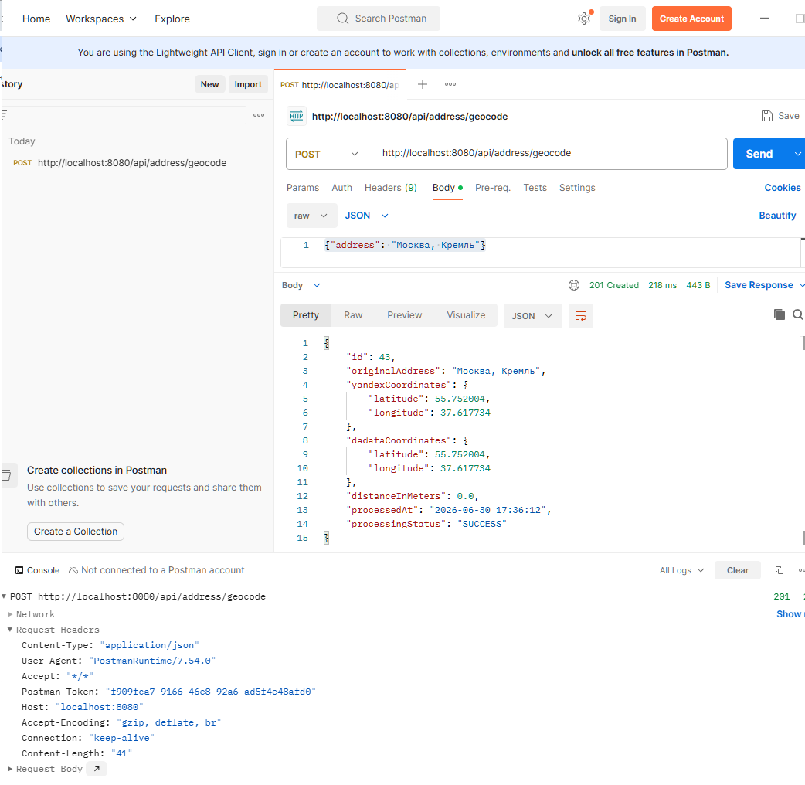

*Отправка запроса на геокодирование через Postman*

### Ответ в Postman

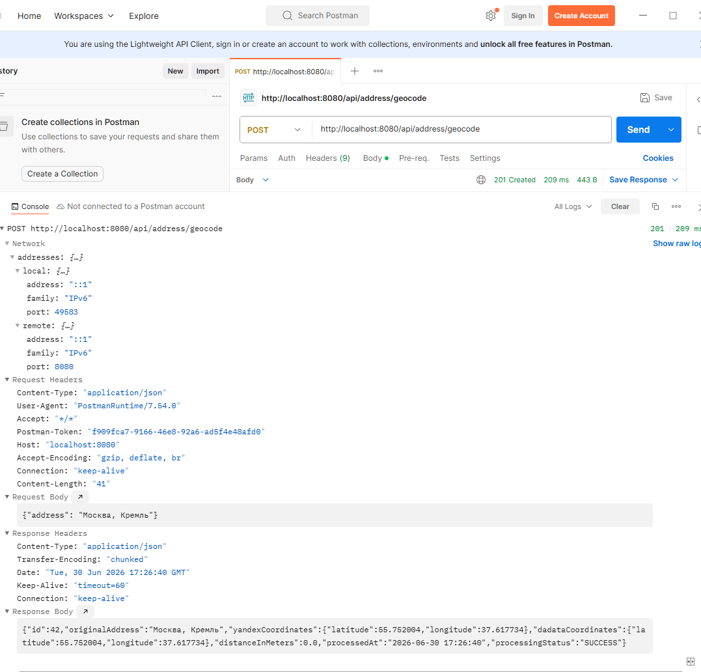

*Полученный ответ с координатами в Postman*

### Health Check

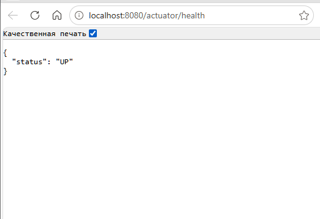

*Проверка состояния приложения через Health Check*

### Пример успешного запроса

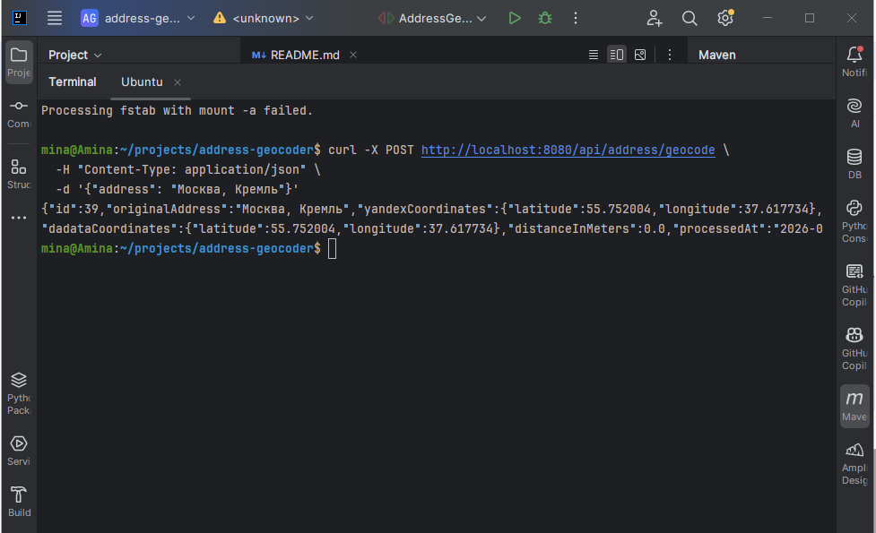

*Рисунок 1: Отправка запроса на геокодирование*

### Пример ожидаемого ответа

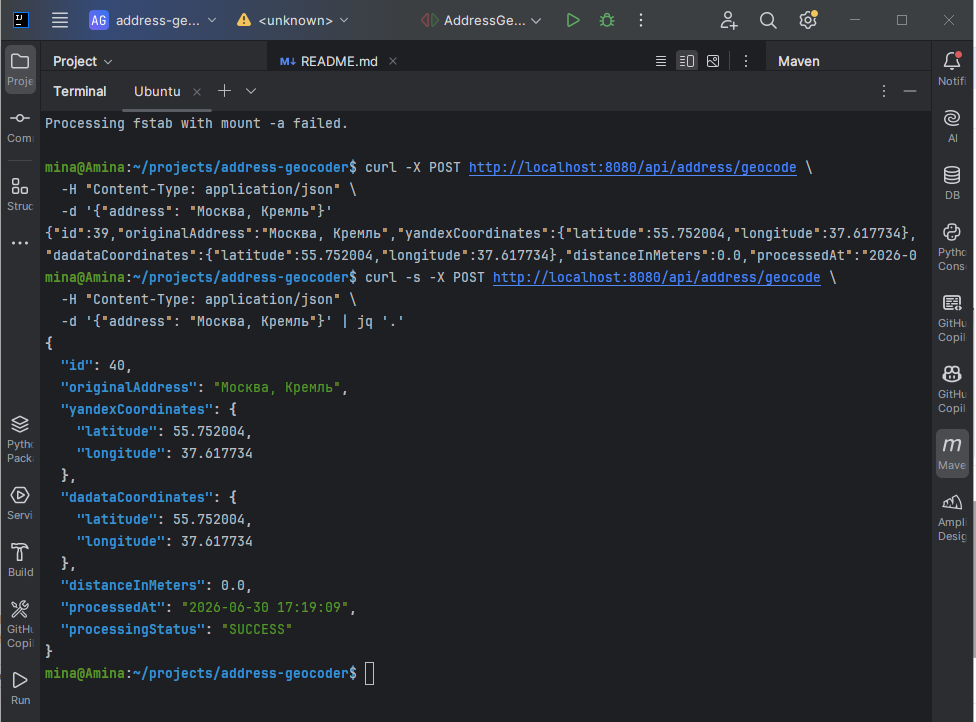

*Рисунок 2: Полученный ответ с координатами*

### Мониторинг в Grafana

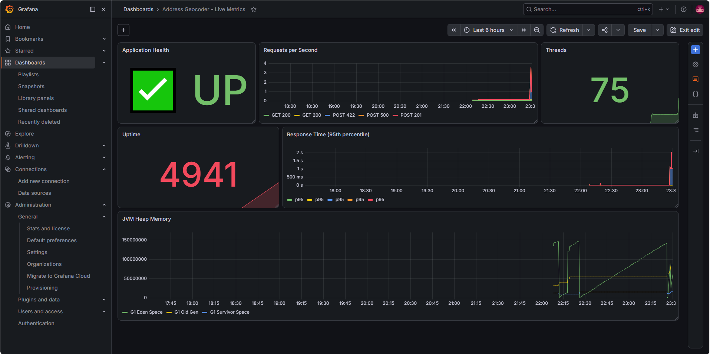

*Рисунок 3: Дашборд с метриками приложения*

## 📸 Демонстрация работы через Swagger UI

### Общий вид Swagger документации

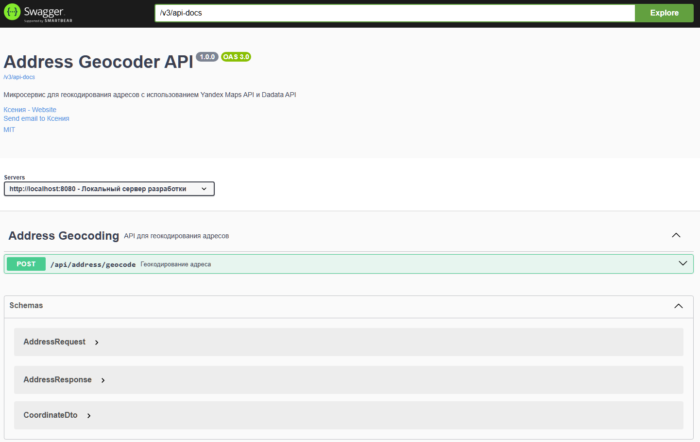

*Интерактивная документация API*

### Отправка запроса на геокодирование

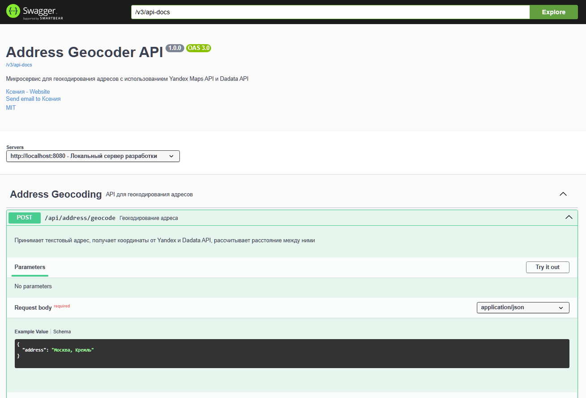

*Пример запроса через Swagger UI*

### Успешный ответ (расстояние 0 метров)

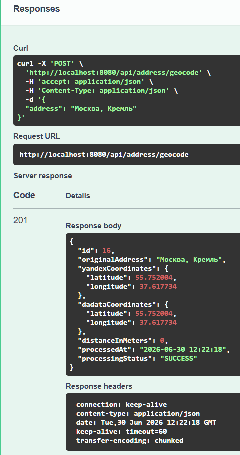

*Успешный ответ с расстоянием 0 метров (координаты совпадают)*

### Успешный ответ (расстояние в метрах)

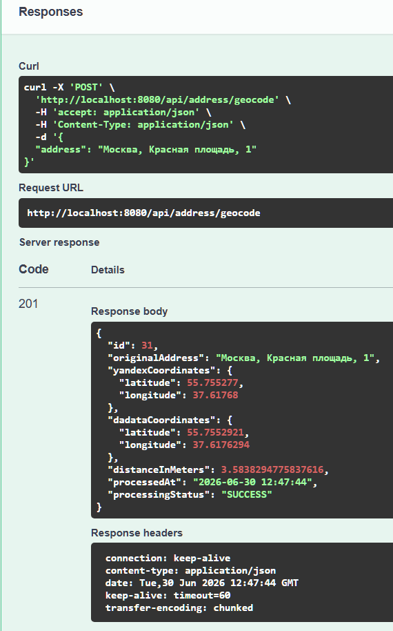

*Успешный ответ с рассчитанным расстоянием в метрах*

### Ошибка валидации в Swagger

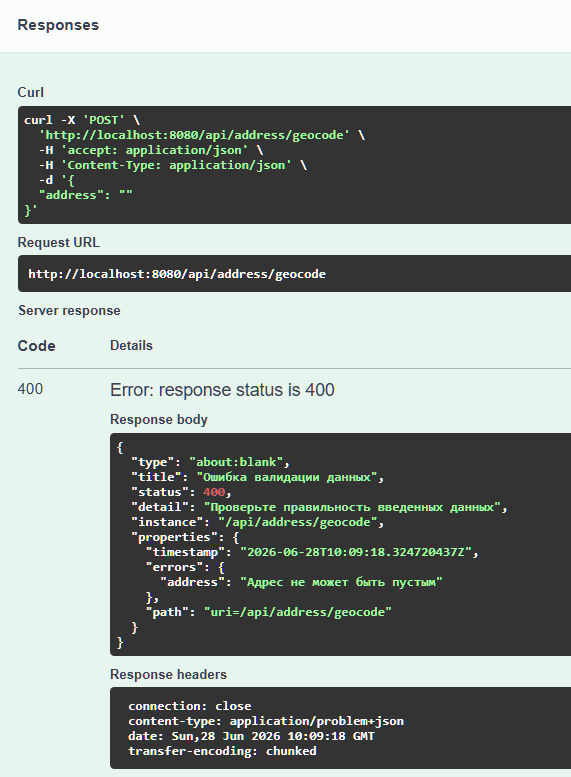

*Ошибка валидации при пустом адресе*

### Ошибка API в Swagger

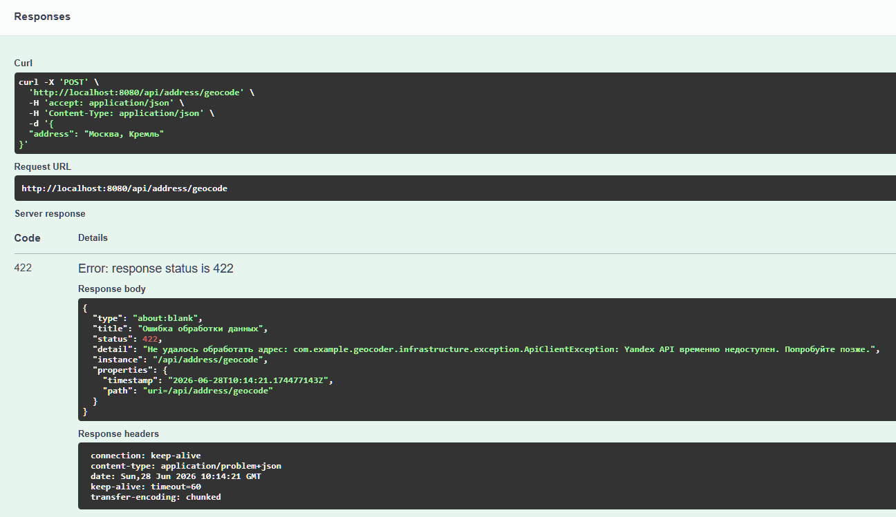

*Ошибка при недоступности API*

### Логи приложения

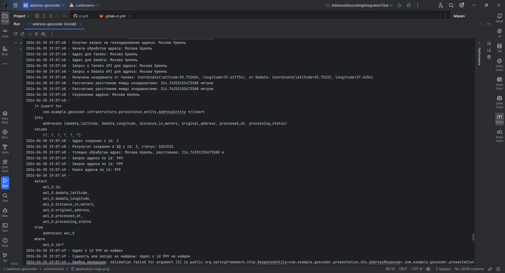

*Логи работы приложения*

---

## 🧪 Тестирование

### Запуск тестов:

```bash
mvn test
```

### Интеграционные тесты используют Testcontainers и поднимают реальную MySQL.

---

## 📊 Мониторинг

- **Метрики:** http://localhost:8080/actuator/metrics
- **Health Check:** http://localhost:8080/actuator/health
- **Prometheus:** http://localhost:8080/actuator/prometheus

## 🔧 Конфигурация

### Основные параметры в application.yml:

```yaml
# Внешние API клиенты
api:
  yandex:
    url: https://geocode-maps.yandex.ru/v1
    api-key: ${YANDEX_API_KEY:your-yandex-api-key}
    timeout: 10000
  dadata:
    url: https://cleaner.dadata.ru/api/v1/clean/address
    api-key: ${DADATA_API_KEY:your-dadata-api-key}
    secret-key: ${DADATA_SECRET_KEY:your-dadata-secret-key}
    timeout: 5000

# Настройки приложения
app:
  distance:
    earth-radius: 6371000 # Радиус Земли в метрах
  geocoding:
    timeout: 15
```

## 🐛 Обработка ошибок

### Сервис использует Problem Details (RFC 7807) для стандартизированного ответа об ошибках:

```json
{
  "title": "Ошибка валидации данных",
  "detail": "Проверьте правильность введенных данных",
  "status": 400,
  "timestamp": "2026-06-27T15:30:00Z",
  "errors": {
    "address": "Адрес не может быть пустым"
  },
  "path": "/api/address/geocode"
}
```

## 🔧 Устранение неполадок

### Ошибка: Dadata API возвращает 403 Forbidden

- Проверьте наличие `DADATA_SECRET_KEY` в `.env`
- Убедитесь, что на балансе Dadata есть средства

### Ошибка: Yandex API возвращает 403 Invalid api key

- Создайте новый ключ для API Геокодера в панели Яндекс Разработчика

### Ошибка: Connection refused (MySQL)

- Проверьте порт 3306: `sudo lsof -i :3306`
- Убедитесь, что MySQL запущен: `docker-compose ps`

## 📈 Производительность

- Таймауты: 5 секунд на внешние вызовы
- Circuit Breaker: Защита от каскадных отказов
- Connection Pool: HikariCP (макс. 10 соединений)
- Retry: Автоматические повторные попытки при временных ошибках

## 🔒 Безопасность

- Валидация входных данных
- API ключи хранятся в переменных окружения
- Защита от SQL-инъекций (JPA + параметризованные запросы)
- **Yandex координаты не сохраняются** (соблюдение лицензионных требований)

## 🚀 Деплой

*Пример Helm-чарта доступен по запросу.*
*Приложение готово к деплою в Kubernetes.*

## 📝 TODO

- [ ] Добавить кэширование (Redis)
- [ ] Добавить асинхронную обработку через Kafka
- [ ] Настроить распределенную трассировку (Jaeger)
- [ ] Реализовать эндпоинты для получения истории запросов

## 👨‍💻 Автор

*Ксения*

## 📋 Лицензионные ограничения

⚠️ **Важно:**

- Координаты от Yandex **НЕ СОХРАНЯЮТСЯ** в базе данных без расширенной лицензии
- В соответствии с [лицензионными требованиями Yandex API Геокодера](https://yandex.ru/legal/maps_api_offer/)
- В БД сохраняются только координаты от **Dadata API**
- **Yandex API** используется только для:
    - Сравнения результатов от двух API
    - Расчета расстояния между координатами

**Для тестового режима:**

- Бесплатный тестовый период: **7 дней**, **100 запросов/сутки**
- Для продакшена требуется оплата: от **195 000 ₽/год**

**Подробнее:**

- [Тарифы и лицензии](https://yandex.ru/dev/tariffs/doc/ru/geocoder/prices/)
- [Официальная оферта](https://yandex.ru/legal/maps_api_offer/)
- [Условия использования API Геокодера](https://yandex.ru/dev/tariffs/doc/ru/geocoder/terms/)

---

## 🔗 Репозитории

- **GitLab:** https://gitlab.com/kxsenia/address-geocoder
- **GitHub:** https://github.com/Tomas-Mart/address-geocoder

---

## 🔗 Полезные ссылки

- **Grafana Dashboard**: http://localhost:3000
- **Health Check**: http://localhost:8080/actuator/health
- **Swagger UI**: http://localhost:8080/swagger-ui/index.html
- **OpenAPI Specification**: http://localhost:8080/v3/api-docs
- **Prometheus Metrics**: http://localhost:8080/actuator/prometheus
